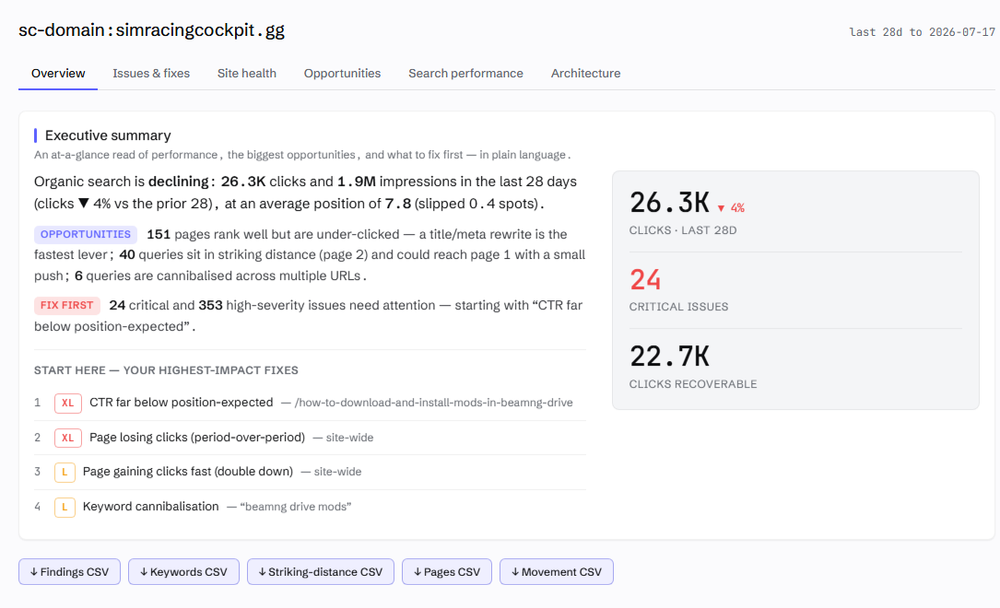
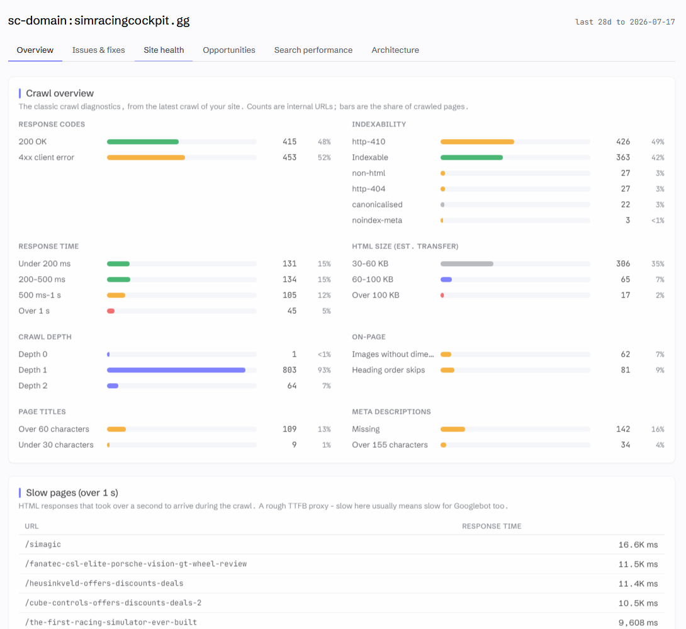
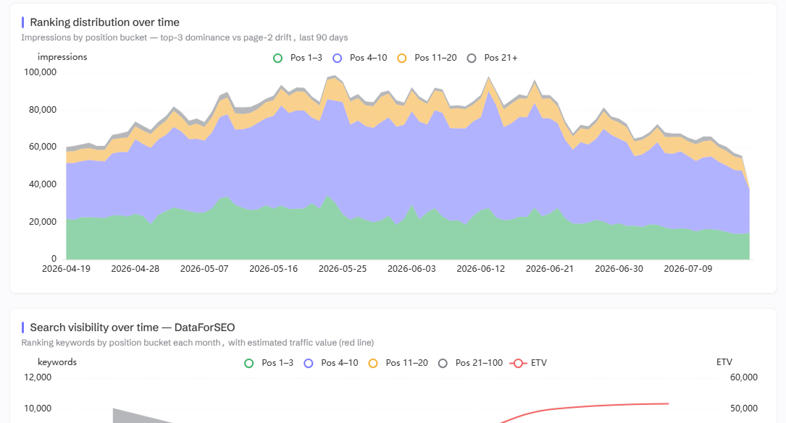

# SEO Audit Console

**A technical SEO audit you can hold a conversation with - built from your own Search Console data and a live crawl of your site, run inside Claude.**

[](./LICENSE)
[](https://modelcontextprotocol.io)
[](https://nodejs.org)

**Built by [Houtini](https://houtini.com).** We build automation for the grunt work of digital marketing - the data collection, the crawling, the merging, the checking - so your team's time goes on the thinking, the strategy and the client work that actually needs a human. This plugin is that idea applied to the technical SEO audit.

```console
you  › run an SEO audit on simracingcockpit.gg

     ⣾ search console  1.8M rows synced (19s - incremental)
     ⣾ crawl           868 pages · HTTP/2 · robots-polite · 8 parallel
     ⣾ link graph      internal PageRank · click depth · in-degree
     ✓ 90 checks · 220 findings · ranked by expected clicks per dev-hour

     #1  CTR far below position-expected    /how-to-install-mods      XL
     #2  Page losing clicks (trend)         site-wide                 XL
     #3  Keyword cannibalisation            "beamng drive mods"       L
     #4  Robots-blocked page earning traffic /category/wheels         L

you  › generate the fix for #1 ▍
```



I've run a lot of technical SEO audits over the years. The hard part was never *finding* the issues - any crawler will hand you a few thousand of those. The hard part is knowing which five things to fix this week, why they matter, and how to actually ship the fix.

So I built the tool I always wanted. SEO Audit Console is a [Model Context Protocol](https://modelcontextprotocol.io) server that merges your **Google Search Console history** with a **first-party crawl of your site** (and, if you want it, **DataForSEO**) into one thing: a prioritised, evidence-backed audit you can interrogate inside Claude Desktop. It hands you paste-ready fixes. And every finding traces back to a real datapoint, so nothing is a black box.

If you want the step-by-step version with screenshots, start with the **[how-to guide](docs/how-to-guide.md)**. This README is the full map - and it assumes nothing, so if you're newer to SEO, start at the next section and read straight down.

---

## New to this? Here's the thirty-second version

Three ideas, and the whole tool falls out of them.

**Google Search Console** (GSC) is Google's free reporting service for site owners. It tells you which searches your pages appeared for, how many people saw you (impressions), how many clicked, and where you ranked. It's the closest thing to ground truth in SEO - it's Google telling you, per query and per page, what actually happened. Most people glance at the graphs and leave. There's far more in there.

**A crawl** is a program visiting your site the way Google's own crawler does - following links, reading each page's HTML, noting titles, redirects, broken links, directives like `noindex`. A crawl tells you what your site *says*. It doesn't tell you what Google *did* about it.

**The merge is the product.** Put those two datasets side by side, joined page by page, and you can ask questions neither can answer alone. Which pages earn impressions but have a title that never mentions the query? Which pages does Google send traffic to that your own navigation can't even reach? Which two pages are competing against each other for the same search? A crawler can't see any of that. Neither can a keyword tool. The overlap is where the money is.

Everything below is a conversation. You type *"run an SEO audit on mysite.com"* into Claude and it happens. No interface to learn - and if you forget what's possible, ask *"run seo_audit_help"* and you get the full menu with example prompts.

---

## Why I built it

A technical audit is usually a commodity. You pay an agency four figures, wait a fortnight, and get a 60-page PDF of everything a crawler could find. Undifferentiated. No traffic context. Stale the day it lands.

The whole thing rests on one idea I keep coming back to:

> **Your crawl is intent. Search Console is reality. The money is where they diverge.**

A flat crawler tells you a page 404s. Useful, but only just. This tells you that the 404 is draining 15% of your homepage's internal PageRank, that the page used to earn 10,000 clicks a month, and it hands you the 301 rule to fix it. It finds the page sitting at position #3 on 150,000 impressions with a 0.2% click-through rate - a title rewrite probably worth thousands of clicks - and it ranks that *above* the cosmetic stuff. Because everything's scored by expected clicks per developer-hour, not by severity.

That last bit matters more than it sounds. Severity is what crawlers sell you. Yield is what actually moves the numbers.

---

## What's different about it

- **Merged, not bolted on.** GSC clicks, impressions and position join your crawl on a normalised URL key. So the checks can ask the questions that need *both* datasets at once - cannibalisation, striking-distance queries, ghost pages (Google sends traffic but the crawl can't reach the URL), high-demand pages starved of internal links.
- **Prioritised by yield.** `Priority = (expected clicks × yield × certainty) / effort-hours`. A 5,000-page template tweak doesn't get to out-rank a single critical canonical bug just because it touches more URLs.
- **Finding, then fix.** It doesn't only flag things. It writes the remediation: valid JSON-LD built from your own page data, exact-match 301 rules for broken links, internal-link suggestions from your highest-authority pages. All dry-run - it returns artifacts, it never touches your site.
- **Honest about confidence.** Every finding is labelled deterministic (here are the bytes) or judgement (gated behind a flag). In my view a wrong finding is worse than no finding at all, so the heuristic stuff has to ask permission.
- **Built for the AI-search era too.** It checks whether your copy actually *says* the phrases you rank for, whether any passage answers the query the way AI search extracts answers (a local relevance model, runs on your machine), and whether your site is ready for AI agents at all - `llms.txt`, `agents.md`, MCP server cards, AI-bot rules.
- **Conversational, and visual.** You ask follow-ups, drill in, and pull up a shareable HTML dashboard or a markdown report when you're done.

---

## The crawl, properly explained

The crawl is where audits usually go wrong, so it's worth understanding what this one does differently. I've spent enough of my career cleaning up after crawlers that fooled themselves.

**It discovers pages three ways.** Following links (the obvious one), reading your XML sitemaps, and - this is the important one - starting from every URL Google is already sending traffic to, straight out of your GSC data. That third source means coverage doesn't depend on your sitemap being honest, and it's exactly how ghost pages get caught: if Google sends clicks to a URL your own site structure can't reach, that URL still gets crawled, and the mismatch becomes a finding. On one site this took crawl coverage of GSC-known URLs from 29% to 70%.

**It records *why*, not just *what*.** For every URL that isn't indexable it stores the reason - 404, noindex, X-Robots header, canonicalised elsewhere, robots-blocked, non-HTML. "This page won't rank" is a fact; "this page won't rank because a plugin set an X-Robots header nobody remembers" is a fix.

**It refuses to be fooled.** A redirect that leaves your site (Shopify OAuth flows, I'm looking at you) is recorded as a redirect-out, never stored as a page. It always uses GET rather than HEAD, because a HEAD request can genuinely return a different status than the real request would - but it abandons the response body for images, PDFs and assets, so it records status and size without downloading the bytes.

**And it's quick without being rude.** It speaks HTTP/2 where your origin supports it (eight parallel fetches multiplex over one or two connections rather than eight sockets), negotiates gzip/brotli compression, and reuses keep-alive connections - so the speed comes from efficiency, not from hammering your server. Respects robots.txt properly (a bot-specific group replaces `*`, per the spec, which plenty of commercial crawlers get wrong), backs off when your host starts rate-limiting, skips the junk - internal search results, faceted filter combinations, login flows. This is a crawler for sites you own. Being a good guest is the point.

After the crawl it computes a real link graph: internal PageRank with nav and footer links down-weighted, click depth from the homepage counting body links only, and in-degree per page. That graph is what powers the orphan-page, equity-leak and underlinked-page checks later - and the donor rankings when it suggests internal links.

---

## Everything it does

Five capabilities, each a conversation away.

### 1. Pull your data

> Refresh sc-domain:mysite.com

`refresh_property` runs the whole pipeline in one step: syncs your Search Console history, crawls your site, checks index coverage via Google's URL Inspection API, and pulls your rank history. The GSC sync is incremental - after the first pull, later syncs fetch only what's new, which turned a 33-minute refresh into 19 seconds on one of my properties. Each part also runs on its own (`sync_gsc`, `start_crawl`, `inspect_urls`, `track_ranks`), and the long ones report progress live so you can watch the page count climb.

### 2. Audit it

> Run an SEO audit on mysite.com

`run_audit` runs **90 checks** over the joined data and gives you a prioritised markdown report - not a wall of everything, a ranked list with the traffic at stake attached to each finding. `query_audit` re-runs any single check with full evidence; `list_checks` shows the whole catalogue. The families:

| Family | What it catches |
|---|---|
| **Crawlability & indexation** | Broken internal links, redirect chains, links through redirects, deep pages, orphans, index bloat, faceted spider-traps, and the *reason* each URL isn't indexable |
| **Canonicalisation & directives** | Broken/chained canonical targets, pagination canonicalising to page 1, noindex conflicts, robots contradictions, HTTPS→HTTP flips |
| **On-page** | Duplicate titles and metas, title/H1 mismatches, missing alt text, heading hierarchy, mixed content, image dimensions (CLS), social tags |
| **Structured data** | A local validator covering ~30 rich-result types (Product, Article, JobPosting, Dataset, Hotel, Restaurant and more) - required fields, value sanity, impossible dates. Required-only by design, so it doesn't nag about properties Google ignores |
| **Internationalisation** | Broken hreflang targets, missing return tags (x-default counts, as it should) |
| **Performance** | Oversized HTML (estimated *transfer* size, not raw bytes), uncompressed responses, and measured Core Web Vitals when you've pulled them |
| **Trends (GSC over time)** | Pages losing clicks period-over-period, page-one rankings slipping, queries that vanished, rising pages worth doubling down on, stale content decaying year-on-year |
| **The merged questions** | Cannibalisation (with sensible thresholds - incidental long-tail appearances don't count), striking-distance queries, ghost pages, traffic to dead URLs, internal authority wasted on no-click pages, titles and H1s missing the query you already rank for |
| **AI-search readiness** | Phrases you rank for but never say in the body, multi-term queries your copy never answers in one place, pages with no extractable answer passage, incoherent inbound anchor text, content that doesn't chunk cleanly for retrieval |

Every check is labelled **D** (deterministic) or **N** (judgement, off by default - say *"include the judgement findings"* to see them).

And if you grew up on desktop crawlers, the dashboard's **Site health** tab will feel like home - response codes, indexability reasons, response-time and page-weight buckets, crawl depth, title and meta issues, the heaviest images your pages load (sampled from headers, the bytes never downloaded), and the server errors and slow pages listed out:



### 3. Fix it

> Generate the fix for the broken link on /old-page
> Write the Product structured data for /widgets

`fix_finding` turns a finding into an artifact you can ship: a complete JSON-LD block built from your own page data, an exact-match 301 rule in `.htaccess`, nginx or Next.js flavour, or a ranked list of internal-link donor pages - your highest-authority pages that don't yet link to the one that needs it, with sensible anchor text. Redirect fixes use the destination the crawler actually recorded; fuzzy matching only steps in for genuinely dead URLs, and it tells you when it's guessing.

### 4. Find the growth

This is the keyword-research and content side, and most of it needs nothing beyond your own GSC data:

- `suggest_pages` - new pages grounded in *real* demand: queries you earn impressions for at rank 11+ with no winning page. It de-duplicates ruthlessly (won't suggest a page you've already got, or a topic one URL already dominates) and tells you the nearest existing page to link the new one from.
- `list_templates` - clusters your site into templates by URL shape and schema type, so one template fix corrects N pages at once. If you've read anything I've written about site architecture, you'll know this is where the long-tail gains tend to hide.
- `score_passages` - the AI-search piece. A small local relevance model (downloads once, ~25MB, no Python, never leaves your machine) reads each ranking page's content against its top query and scores whether *any* passage actually answers it. It's a classifier, not a generator - it can't hallucinate. Pages that rank on demand they never densely answer are your rewrite list.
- `draft_content` - the follow-through. It assembles a grounded writing brief from the page itself: the query gap, the page's own paragraphs as voice exemplars, and its most query-relevant passages as the only permitted facts. Claude then drafts the missing passage in *your site's* voice, inventing nothing.
- `resolve_entities` - maps your pages to Wikidata entities and finds internal-link gaps between topically-related pages.
- `detect_changes` - compares your two most recent crawls and flags what moved, by severity. A page that went noindex, a canonical that flipped, a title that changed. Refresh on two different days and this becomes your monitor.
- `check_agent_readiness` - scores your site 0-100 for the AI-agent audience: `llms.txt`, `agents.md`, AI-bot rules in robots.txt, MCP server cards, OAuth discovery, markdown content negotiation. With copy-paste fixes. And it's not fooled by a catch-all route that 200s everything.

### 5. Share it

> Show me the dashboard for mysite.com

`get_dashboard` opens an interactive dashboard right in the chat - findings treemap, rank trends, the equity-vs-reality scatter (internal PageRank against actual impressions, which is where the structural stories jump out), cannibalisation, keyword movement, CSV export. `export_report` writes the same thing as a single self-contained HTML file you can send to a client. No login, nothing installed.

The Search performance tab is the Search Console view you wish Google shipped - and because the history lives in your own database, it isn't capped at 16 months:



---

## What DataForSEO adds (and what it costs)

Everything above works with just your Search Console data. But GSC can only tell you about searches where you already appear. The moment your question is "how big is this market?" or "what do my competitors rank for that I don't?" - you need third-party data, and that's what [DataForSEO](https://dataforseo.com/?aff=213701) is: a pay-as-you-go API for search volumes, live rankings, competitor data and Lighthouse runs. No subscription, no seat licence. You top up a balance and individual calls cost fractions of a cent to a few cents.

With an account connected you get:

- `keyword_volume` · `related_terms` - real monthly search volumes and term expansion. This is how you size an opportunity before writing a word.
- `search_intent` - classifies queries as informational, commercial, navigational or transactional. Also feeds an audit check that flags intent-vs-page-type mismatches (a blog post ranking for a "buy" query, say).
- `competitors_domain` · `page_intersection` - who you actually compete with in search (measured from ranking overlap, not who you *think* your competitors are), and the content gap: queries they rank for where you don't show up at all.
- `page_lighthouse` - lab Core Web Vitals per URL, feeding the high-yield-CWV-fail check.
- `pull_backlinks` - your backlink profile with live status checks, so links pointing at 404s get caught. (Heads up: the Backlinks API is a separate DataForSEO subscription from SERP/Keywords/Labs. If it isn't activated the tool says so plainly rather than failing quietly.)

I'm deliberately careful with your balance. The audit only ever calls DataForSEO **on demand** - one call per question you ask, cached for 20 days. It never fires in bulk behind your back. My own usage runs to a few dollars a month.

---

## What you'd actually use it for

Recipes, basically. Each of these is a real workflow, with the prompts to type.

### Your first audit (day one)

> list properties
> Refresh sc-domain:mysite.com
> Run an SEO audit on mysite.com

Twenty minutes on a mid-size site, most of it the crawl. What comes back is a ranked list - and the top five findings are usually worth more than the other seventy-five combined. Ask about any of them: *"show me the evidence for the cannibalisation finding"*. Then *"generate the fix"*.

### Sitewide keyword optimisation

The workflow I probably use most. The question isn't "what keywords should I target?" - it's "where does my copy fail to say what I already rank for?"

> Run an SEO audit on mysite.com

Look at the merged findings: titles missing the query the page ranks for, H1 mismatches, phrases you earn impressions on but never say in the body. These are pages Google already half-trusts. You're not chasing new rankings - you're closing the gap between the demand you're getting and the copy you're serving, which is far easier.

> Score the passages on mysite.com

Now the deeper cut: which ranking pages never actually *answer* their top query in any one passage. That's your rewrite list, in priority order.

> Draft the missing content for /sim-racing-wheels

And the follow-through - a grounded brief and a drafted passage in your site's own voice. Work down the list a page at a time. On sites with a few hundred indexed pages this is weeks of traditional keyword-mapping work collapsed into an afternoon, and every line of it grounded in queries you already appear for.

### Fixing cannibalisation

Two of your pages competing for the same query means Google alternates between them and neither settles. The audit finds these with thresholds tuned to ignore incidental long-tail overlap - then you decide: consolidate, differentiate, or canonicalise.

> Show me the cannibalisation findings for mysite.com with evidence

The evidence includes which page you'd keep (the one with better engagement and links, usually) and the internal-link donors to strengthen it.

### The content refresh list

> Run an SEO audit on mysite.com and include the judgement findings

The trends family surfaces decay: pages losing clicks year-on-year, page-one rankings slipping to page two, queries that vanished. Stale content decays quietly - this makes it loud. Cross-reference with `suggest_pages` and you have next quarter's content plan: what to refresh, what to write, what to let die.

### The new-content pipeline

> Suggest new pages for mysite.com
> What's the search volume for "standing desk converter"?
> What do my competitors rank for that I don't?

`suggest_pages` works from your own impressions - demand Google has already shown you. Volume sizing and the competitor gap (both DataForSEO) tell you which ideas deserve to be first. Each suggestion comes with the nearest existing page to link from, so nothing launches as an orphan.

### The template play

> List the page templates on mysite.com

Big sites aren't 50,000 pages - they're a dozen templates, repeated. One template fix corrects every page in the cluster. On ecommerce and programmatic sites this is where the big gains hide, and it's the lens I'd start with on anything over a few thousand URLs.

### Monitoring, migrations, and "what changed?"

> Refresh sc-domain:mysite.com
> Detect changes on mysite.com

Run a refresh on a schedule and `detect_changes` diffs the two most recent crawls by severity: a page that went noindex, a canonical that flipped, titles that changed. During a migration or replatform this is the difference between catching a stray noindex on Tuesday and explaining a traffic graph in a board meeting three weeks later. I've been on the wrong end of that one.

### Client and stakeholder reporting

> Export the report for mysite.com

A single self-contained HTML file - dashboard, findings, trends, the lot. Send it to a client, attach it to a ticket, drop it in Slack. Nothing to install, no login, and every claim in it traces to a datapoint.

### AI-search readiness

> Check agent readiness for mysite.com
> Score the passages on mysite.com

Two halves. Agent readiness is the infrastructure: `llms.txt`, `agents.md`, AI-bot rules, MCP discovery - scored 0-100 with copy-paste fixes. Passage scoring is the content: AI search doesn't rank your page, it extracts your answer, and pages that rank without densely answering are exposed. In my view this is the audit gap of the next few years, and it's why the local relevance model exists.

---

## Installation

### What you need first
- **Node.js ≥ 20**
- **Claude Desktop** (or any MCP client)
- A **Google Search Console** property you own (free - if your site isn't verified there yet, do that first; it's ten minutes and you should have it regardless)
- *Optional:* a **DataForSEO** account for volumes, SERP data, competitor gaps, lab CWV and backlinks

### 1. Build it
```bash
git clone https://github.com/houtini-ai/seo-audit-console.git
cd seo-audit-console
npm install
npm run build
```

### 2. Connect Google Search Console
The tool reads GSC through a **Google Cloud service account** - a robot login you create once, rather than an OAuth dance every session:
1. In [Google Cloud Console](https://console.cloud.google.com), create a project and **enable the Search Console API**.
2. Create a **service account** and download its **JSON key**.
3. In [Search Console](https://search.google.com/search-console), under *Settings → Users and permissions*, add the service account's email as a **user** on each property you want to audit.

That third step is the one people miss. The service account is its own "person" - it sees nothing until you add it to the property, same as any colleague.

### 3. Configure Claude Desktop
Add this to `claude_desktop_config.json` (Settings → Developer → Edit Config):

```json
{
  "mcpServers": {
    "seo-audit-console": {
      "command": "node",
      "args": ["C:/path/to/seo-audit-console/dist/index.js"],
      "env": {
        "GOOGLE_APPLICATION_CREDENTIALS": "C:/path/to/service-account.json",
        "SAC_DATA_DIR": "C:/path/to/where/audits/are/stored",
        "DATAFORSEO_USERNAME": "you@example.com",
        "DATAFORSEO_PASSWORD": "your-dataforseo-password"
      }
    }
  }
}
```
Only `GOOGLE_APPLICATION_CREDENTIALS` is required. Restart Claude Desktop, then ask *"list properties"* to check it's connected.

| Env var | Required | Purpose |
|---|---|---|
| `GOOGLE_APPLICATION_CREDENTIALS` | ✅ | Path to the GSC service-account JSON |
| `SAC_DATA_DIR` | optional | Where per-property SQLite DBs and reports live (defaults to `~/Documents/seo-audit-console`) |
| `DATAFORSEO_USERNAME` / `DATAFORSEO_PASSWORD` | optional | Switches on the keyword / SERP / competitor / CWV / backlink tools |
| `DATAFORSEO_CACHE_DAYS` | optional | DataForSEO response cache TTL (default 20 days) |

### 4. (Optional) DataForSEO
👉 **[Create a DataForSEO account](https://dataforseo.com/?aff=213701)** - pay-as-you-go, called on demand only, cached for 20 days.

Everything else - the crawl, the merge, most of the checks, the priority model, the fixes, the dashboard - works with **just Search Console**.

---

## The tools, at a glance

| Tool | What it does |
|---|---|
| `refresh_property` | Sync GSC + crawl + inspect + rank history, in one step |
| `sync_gsc` · `start_crawl` · `inspect_urls` · `track_ranks` | Run a single part on its own |
| `check_sync_status` · `check_crawl_status` | Watch a long job's progress |
| `run_audit` | Scored, prioritised findings → markdown |
| `query_audit` · `list_checks` | One named check with its evidence · list every check |
| `fix_finding` | Paste-ready remediation (JSON-LD / 301 / internal links) |
| `list_templates` | Cluster pages into templates (one fix → N pages) |
| `suggest_pages` | New-page ideas grounded in real demand |
| `score_passages` | Local relevance model: does any passage answer the page's top query? |
| `draft_content` | Grounded writing brief so Claude can draft the missing passage in your site's voice |
| `detect_changes` | What changed between the two most recent crawls, by severity |
| `check_agent_readiness` | 0-100 AI-agent readiness score with copy-paste fixes |
| `resolve_entities` | Map pages to Wikidata entities, find entity link gaps |
| `get_dashboard` · `export_report` | Interactive in-chat dashboard · shareable HTML |
| `keyword_volume` · `related_terms` · `search_intent` | DataForSEO keyword data |
| `competitors_domain` · `page_intersection` | DataForSEO competitive / content-gap |
| `page_lighthouse` · `pull_backlinks` | Lab CWV · backlink profile with live status |
| `normalize_url` · `data_location` · `list_properties` | Utilities |
| `seo_audit_help` | Every feature, with an example prompt |

---

## How it works under the hood

- **The join key (`url_key`).** GSC `page` and crawl `url` both normalise down to the same key - force HTTPS, unify www and apex, strip tracking params, and so on. Everything joins on that. It's the whole trick, really.
- **One SQLite database per property** (WAL, prepared statements). Your data stays on your machine.
- **Scored once, sorted by yield.** `(expected clicks × yield × certainty) / effort`. Covering-indexed, so the audit stays fast even when the GSC table runs to millions of rows.
- **Careful with your history.** Crawls and syncs never destroy the previous snapshot until the new data has actually started arriving - a site outage mid-crawl doesn't cost you your data.
- **Owned-site only, dry-run fixes.** It crawls sites you control, and the generators return artifacts. They never write to your site. That's a line I won't cross.

---

## Privacy and data

Your Search Console data and the crawl live in local SQLite files under `SAC_DATA_DIR`. The passage-scoring model runs locally too - your content never goes anywhere for scoring. Nothing leaves your machine except the API calls *you* trigger - Google (your own GSC) and, if you've set it up, DataForSEO. No telemetry. None.

---

## What's coming

A few things I'm building next, in rough order:

- **Structured-data opportunities, by template.** Not "you have no schema" (most modern stores have plenty), but "this template could earn review stars or an FAQ rich result and doesn't." One fix per template corrects every page in the cluster.
- **A per-page content scorecard.** The checks already catch phrases you rank for but never say; a dedicated table of *every* ranking phrase your copy misses is next.
- **More agent readiness.** A WebMCP advisory (which tool actions your site could expose to agents) and the agent-commerce protocols.
- **A printable report.** A proper A4 document you can hand a client, not a slide deck.
- **Source-level parser checks.** The audit spec is written - [~94 checks](docs/DEFINITIVE-TECHNICAL-AUDIT.md) covering the layer most tools never touch: elements that silently break `<head>` parsing, canonical and hreflang directives that get hoisted into the body and ignored, raw-vs-rendered divergence, service workers feeding Google a stale shell. The crawler already fetches everything these checks need.

Got a weird edge case you wish a tool caught? Tell me - that's exactly how the merged GSC×crawl checks got built.

## About Houtini

[Houtini](https://houtini.com) exists for one reason: the hours your team loses to grunt work. Pulling Search Console exports, running crawls, cross-referencing spreadsheets, re-checking what changed since last month - none of it needs a person, and all of it eats the time your people should be spending on strategy, on clients, on the work that moves numbers. So we automate exactly that layer. SEO Audit Console is one of a family of tools built on the same principle - if a machine can collect it, merge it and check it, a machine should.

Questions, licensing, or something you'd like automated: **hello@houtini.com**

## Contributing

Issues and PRs welcome. The check registry (`src/audit/checks.ts`) is built to be extended - each check is a pure read over the joined data that returns findings with evidence, so adding one is fairly self-contained. There's an end-to-end smoke test (`npm run smoke`) and per-feature probes (`npm run probe:*`) to keep you honest. By submitting a PR you grant the licence set out in the [LICENSE](./LICENSE) contributions clause.

## License

**Source-available, converting to open source.** Free to download, build, and run unmodified for personal, evaluation, and educational use. Commercial use - including agency and client work - needs a [commercial licence](./COMMERCIAL.md), which is a short email away. Modifications and redistribution need written permission. And every released version automatically becomes **Apache 2.0** three years after its release, so nothing stays locked up forever. Full terms in [LICENSE](./LICENSE).
