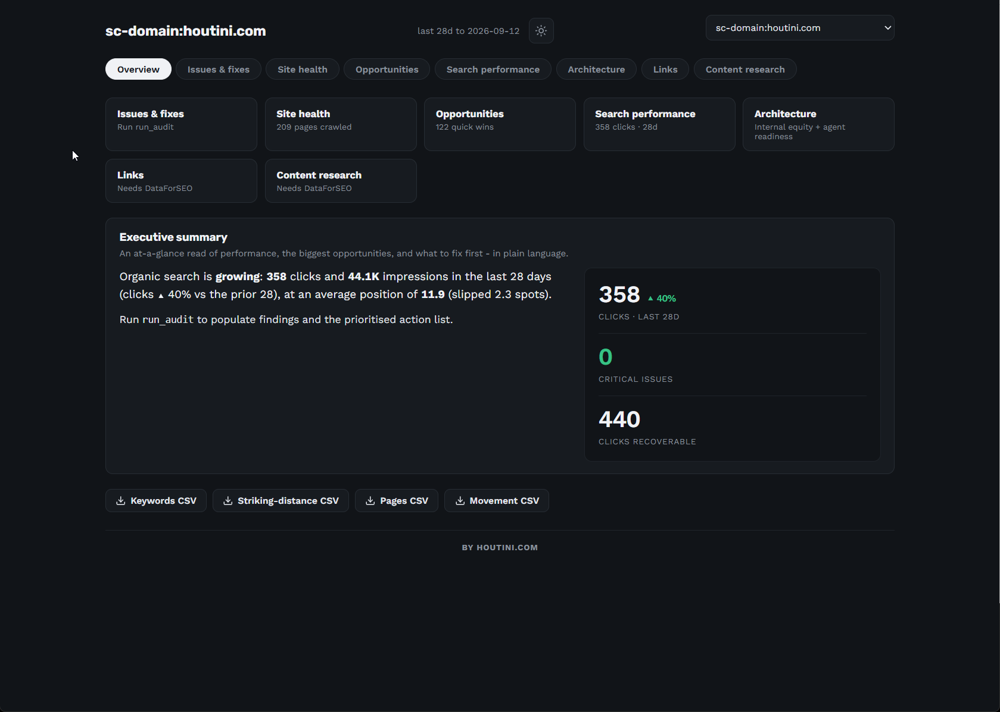
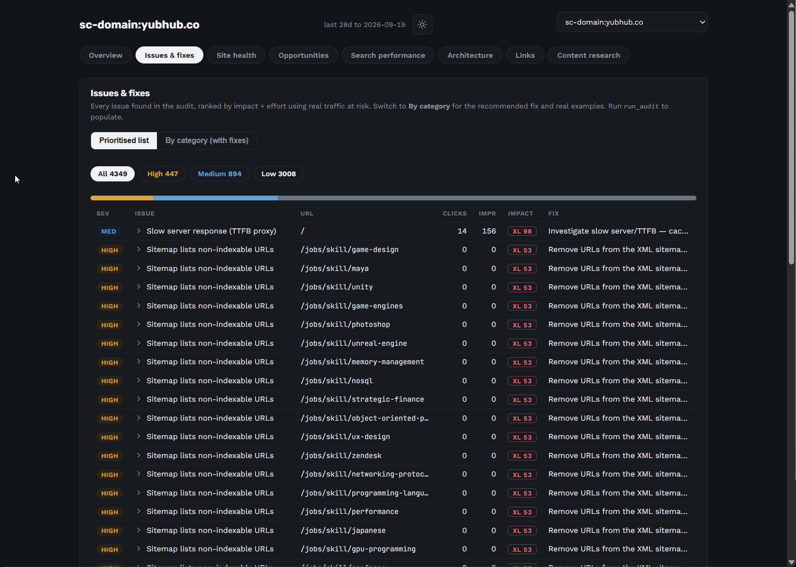
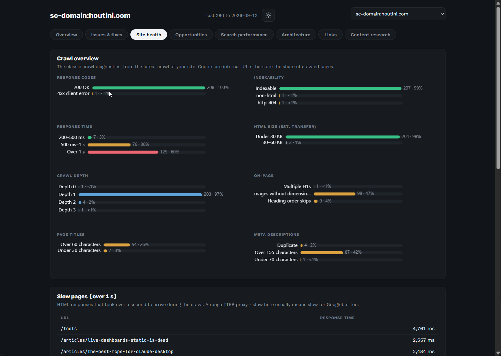
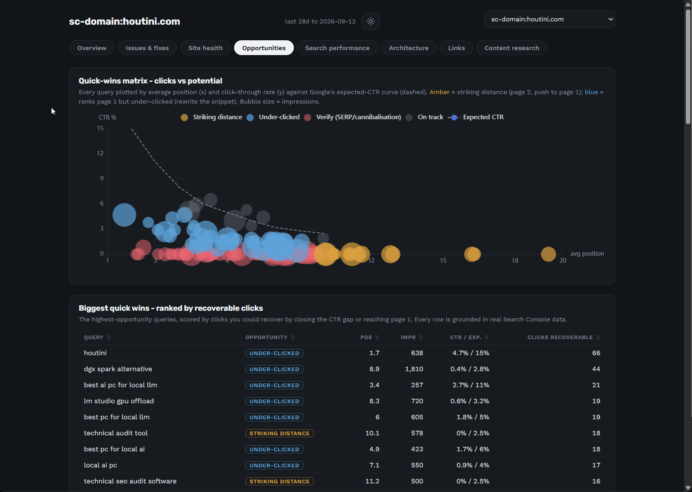
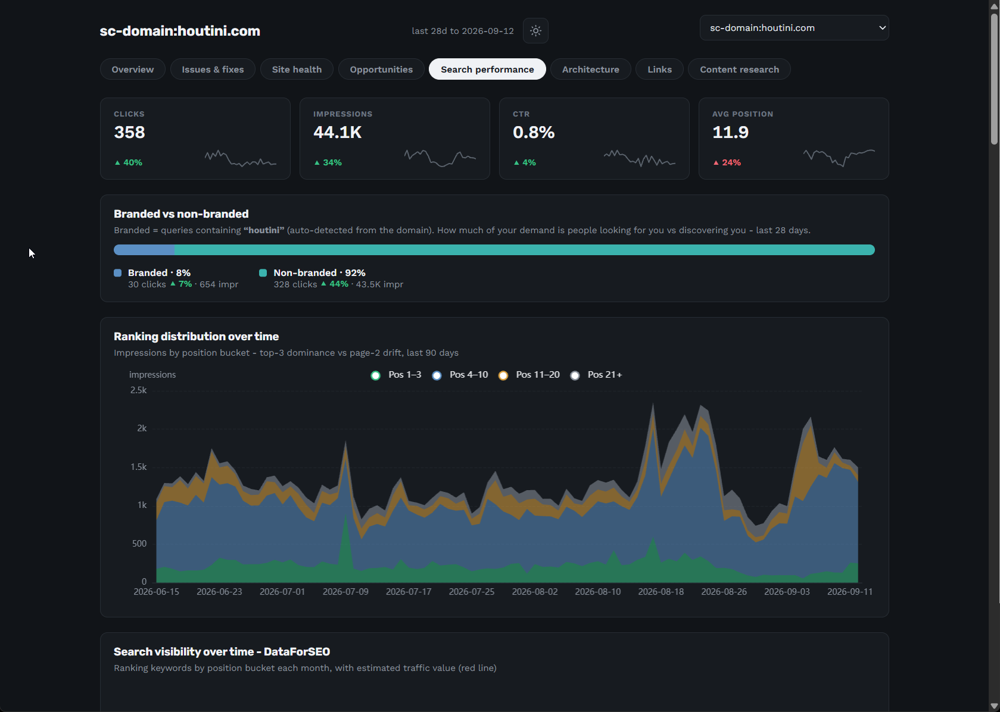
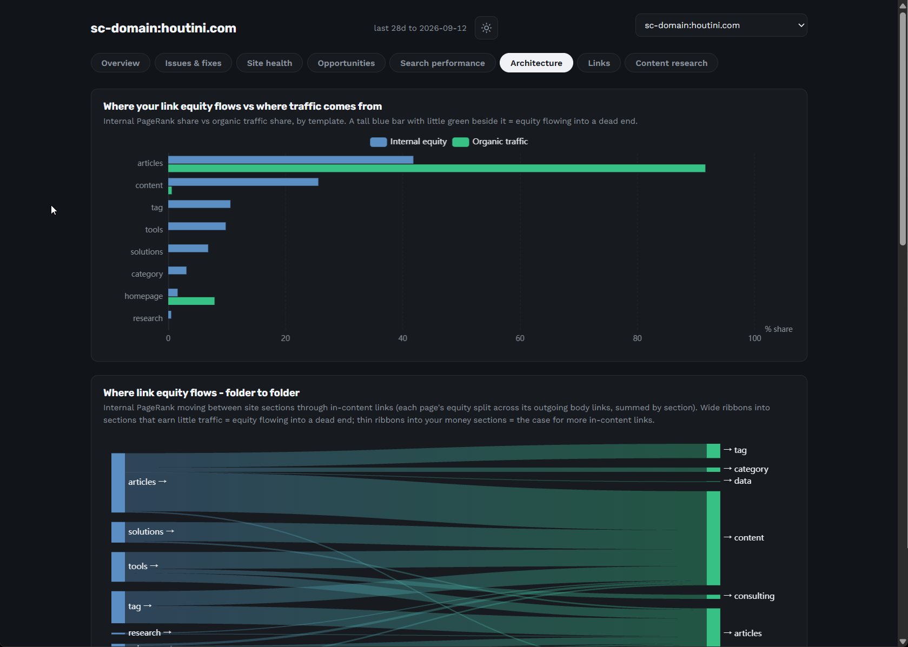

# The dashboard and reports

Two ways to look at everything at once: the interactive dashboard rendered right in the chat (*"show me the dashboard for mysite.com"*), and the same thing exported as a single shareable HTML file (*"export the report"*). Both are built from your synced data, both are organised into six tabs, and every number in them traces back to a datapoint in your database.

Run `refresh_property` first, and `run_audit` if you want the findings populated. The DataForSEO panels (visibility over time, agent readiness) fill in when you've run the corresponding tools; everything else works from GSC and the crawl alone.

## Overview

The executive summary: clicks and impressions for the last 28 days against the prior period, the headline finding counts, and the top issues by impact. It's the tab you'd screenshot for a stakeholder - the state of the property in one screen.

## Issues & fixes

The audit findings, two ways: a **prioritised list** (the same order `run_audit` returns - expected clicks per developer-hour) and a **by-category view with fixes**, where each check groups its affected pages with the remediation attached.

Each finding shows an **impact score (0-100, normalised to the run's biggest finding)** and a **size badge (S / M / L / XL)** rather than a raw clicks forecast. That's deliberate: the underlying model estimates recoverable clicks, but presenting a precise number would read as a promise, and it isn't one. Real measured traffic stays real; estimates stay relative.

## Site health

If you grew up on desktop crawlers, this tab is home. The classic crawl diagnostics as clean stat bars: **response codes**, **indexability reasons** (with the *why* for every non-indexable URL), **response-time** and **HTML-size buckets** (measured on estimated transfer, not raw bytes), **crawl depth**, and title/meta issue counts. Below the bars, the lists: server errors (5xx), pages over a second, and the heaviest images your pages load - sampled from response headers during the crawl, so the image bytes are never downloaded.

## Opportunities

Where the growth work lives:

- **Quick-wins matrix** - current clicks against recoverable potential, per page, so the underpriced fixes jump out.
- **Biggest quick wins** - the same thing as a ranked table.
- **Content decay** - the refresh list: pages losing clicks period-over-period.
- **Keyword cannibalisation** - the competing URLs per query, with each URL's share of the impressions, so the consolidate-or-differentiate call is made on numbers.
- **Cannibalisation over time** - my favourite chart in the product: for a contested query, which URL Google picked, week by week. When the lines braid, Google can't decide, and that's the page pair to fix first.

## Search performance

The Search Console view you wish Google shipped - and because the history lives in your own database, it isn't capped at 16 months:

- **Branded vs non-branded** clicks split.
- **Ranking distribution over time** - impressions by position bucket, the honest "are we improving" chart.
- **Search visibility over time** - the DataForSEO monthly rank distribution, reconciled with your GSC dates (needs `track_ranks`).
- **Rank & clicks over time**, together on one axis.
- **Top keyword and page performance**, 28 days against the prior 28.
- **Keyword ranking movement** over 90 days - risers and fallers.
- **Breakdowns by device and country** - these appear when you've synced with `segments:true` ([tools.md](tools.md#sync_gsc)).

Tables export to CSV where you'd want them to.

## Architecture

The structural story - where your internal link equity goes versus where your traffic comes from:

- **Equity flow vs traffic by template** - each template's share of internal PageRank against its share of impressions. A template hoarding equity while earning nothing is a structural decision worth revisiting.
- **Equity vs reality, every URL** - the scatter of internal PageRank against impressions. The corners are the findings: high equity + no traffic (wasted authority), high traffic + no equity (underlinked winners, and the pages a redesign would quietly kill).
- **Top linked pages and their status** - your most internally linked URLs with their live HTTP status. A non-200 high on this list is an equity leak in plain sight.
- **Agent readiness** - the 0-100 score and category checklist from `check_agent_readiness`, once you've run it.

## Exporting: `export_report`

> Export the report for mysite.com

Writes the whole dashboard - data and charts inlined - to a single self-contained HTML file in your reports folder (under the data directory, path returned by the tool). Open it in any browser, attach it to an email, hand it to a client; the recipient needs nothing installed and nothing running. It's a snapshot of the moment you exported, so re-export after a refresh when you want current numbers. A `theme` option gives you light or dark.

One honest limitation: the in-chat widget and the export are the same dashboard, so anything the widget can't show (because you haven't synced or run the relevant tool), the export can't either. The export tells you the finding count it shipped with, which is a decent staleness check.
