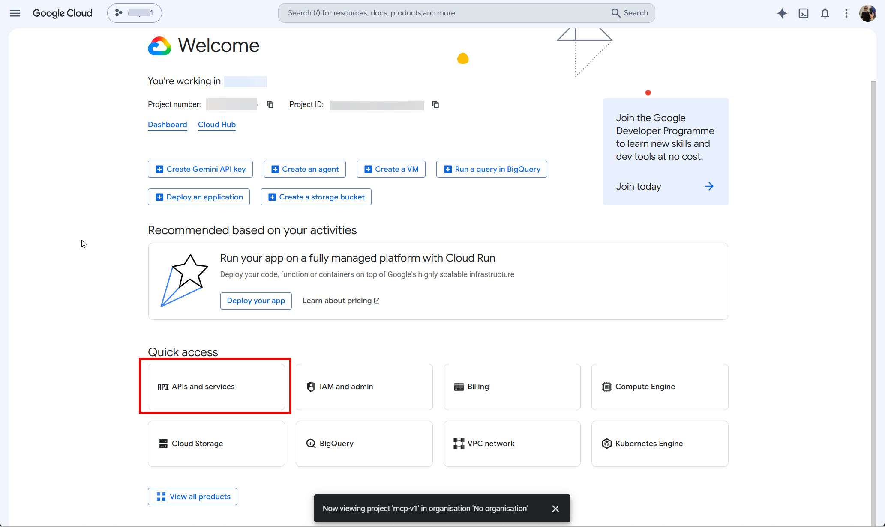
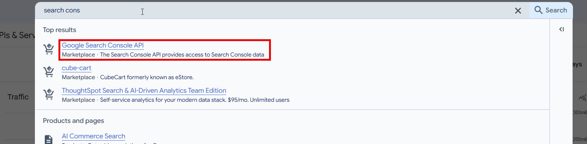
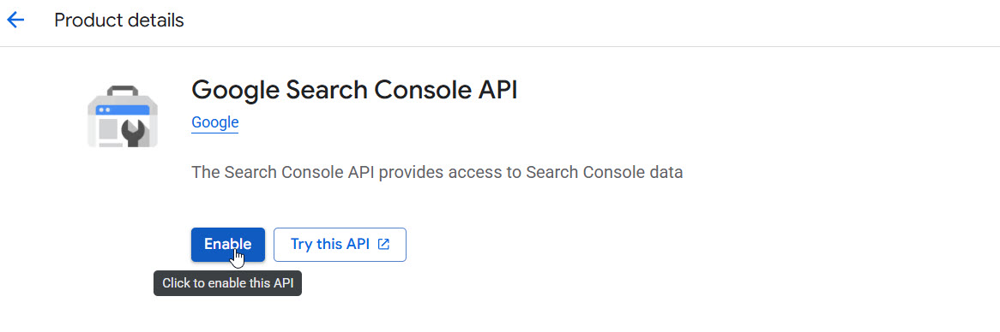
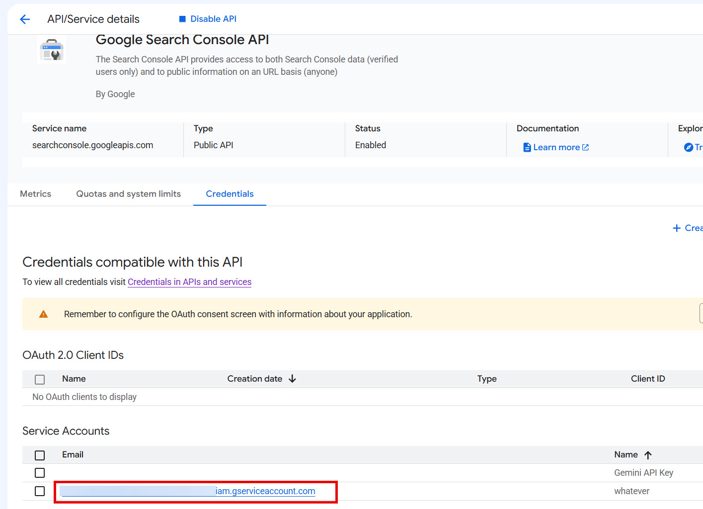
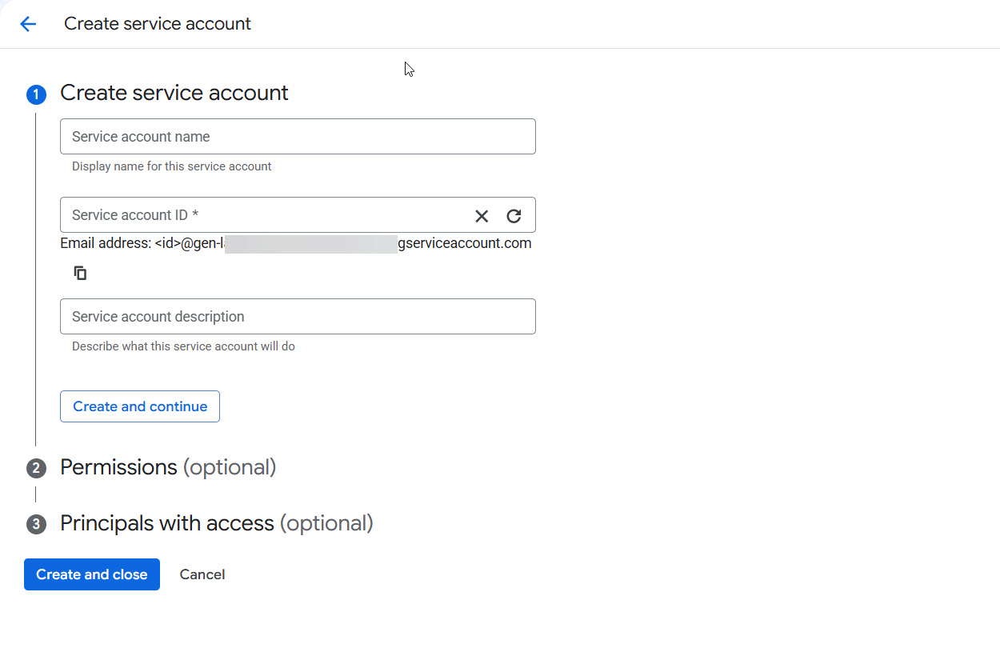
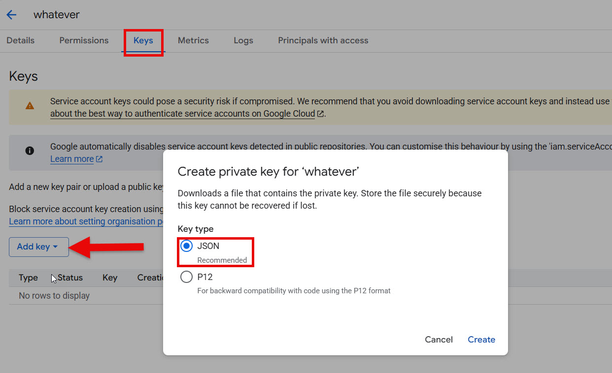
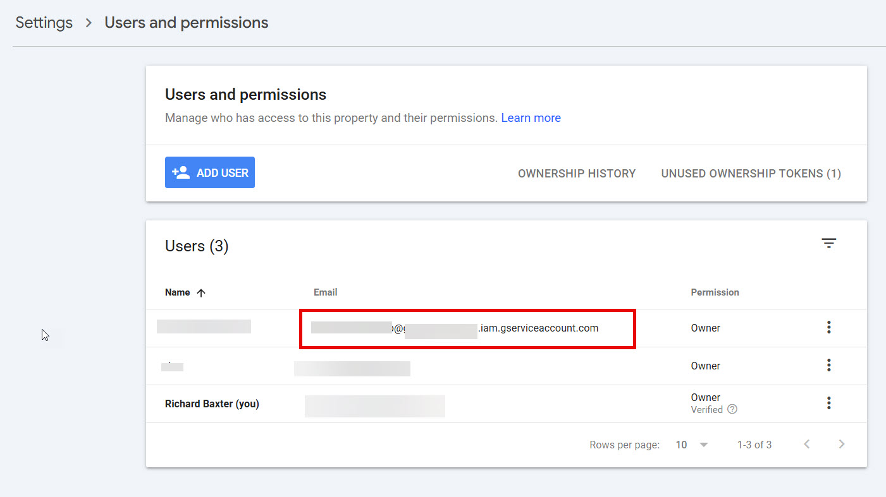

# Getting started

This page takes you from nothing to your first audit: install, connect Google Search Console, wire it into Claude Desktop or Claude Code, run the first refresh, and read the results. It's a one-time, ten-minute setup job, and the step people miss is flagged clearly below.

## What you need

- **Node.js 20 or newer** (never installed it? Step 0 below walks you through it)
- **Git** - or not; you can skip it entirely with the ZIP download in step 1
- **Claude Desktop** or **Claude Code** (any MCP client works; these are the two I test on)
- A **Google Search Console property you own**. If your site isn't verified there yet, do that first - it's free, takes ten minutes, and you should have it regardless of this tool.
- *Optional:* a **DataForSEO** account, for keyword volumes, competitor data and backlinks. Everything else works without it. See [competitive.md](competitive.md) for what it adds and what it costs.
- *Optional, and only if you do link building:* a **[Majestic](https://majestic.com/plans-pricing)** API key. It enriches the `link_intersect` prospect list with **Trust Flow** and **Topical Trust Flow** and re-sorts it by real editorial authority, which is what stops directories sitting at the top of your outreach list. `link_intersect` runs fine without it.
- *Optional, for content recon only:* **[Firecrawl](https://firecrawl.link/2d1PLD8)** and **[Supadata](https://supadata.ai)** keys, for fetching competitor pages and transcribing ranking videos.

## The quick route: npx (no clone, no build)

The tool is on npm, so you can skip Git and the build entirely - you still need Node.js from step 0, but nothing else. Point your MCP config straight at the package:

```json
{
  "mcpServers": {
    "seo-audit-console": {
      "command": "npx",
      "args": ["-y", "@houtini/seo-audit-console"],
      "env": {
        "GOOGLE_APPLICATION_CREDENTIALS": "C:/path/to/service-account.json"
      }
    }
  }
}
```

That's the minimum config - one env var. Every optional service (DataForSEO, Majestic, Firecrawl, Supadata) is another line in the same `env` block; the full list is [in step 3a](#environment-variables) below.

npx downloads and runs the published build on first launch, and you pick up new versions without ever touching a terminal again. The clone-and-build route below is for anyone who wants the source - to read it, extend it, or run ahead of releases. Everything from step 2 (Search Console) onwards is identical for both routes.

## One-click install (Claude Desktop extension)

There's also a packaged Claude Desktop extension - a `.mcpb` bundle you double-click (or drag into Claude Desktop's Settings → Extensions) and it installs itself, Node runtime included. Claude Desktop then prompts you for the settings instead of you editing JSON: a file picker for the Google service-account key, an optional data directory, the optional DataForSEO credentials, and the optional Majestic API key (the Trust Flow tier for `link_intersect`).

Honest status: the bundle is **available from our [GitHub releases](https://github.com/houtini-ai/seo-audit/releases), pending review for the Claude extension directory** - so for now it's a download, not an in-app search result. You still need the Search Console service account from step 2 below; the extension only removes the Node/JSON-editing steps. Note the bundle is built per-platform (native SQLite/ONNX modules), so grab the one matching your OS.

## 0. Install the tools this tool is built with

If you're an SEO rather than a developer, your machine probably doesn't have Node.js or Git yet. Both are free, both install in a couple of minutes, and neither will bother you again afterwards.

**Node.js** is the runtime the server runs on - it's what Claude actually starts when it loads the tool.

- **Windows:** download the **LTS** installer from [nodejs.org](https://nodejs.org), run it, accept the defaults. Done.
- **Mac:** same [nodejs.org](https://nodejs.org) LTS installer works; if you already use Homebrew, `brew install node` does the same job.

Check it worked - open a terminal (Windows: search for "PowerShell"; Mac: search for "Terminal") and type:

```bash
node --version
```

Anything starting `v20` or higher and you're set. `npm` (the package installer used below) comes bundled with it - nothing extra to do.

**Git** is how you download the code and, later, pull updates with one command.

- **Windows:** download from [git-scm.com](https://git-scm.com/download/win), run the installer, accept the defaults (there are a lot of option screens; the defaults are all fine).
- **Mac:** type `git --version` in Terminal - macOS offers to install its command-line tools if Git isn't there yet. Say yes.

**Don't fancy Git at all?** You don't strictly need it. On the [GitHub page](https://github.com/houtini-ai/seo-audit), click the green **Code** button, then **Download ZIP**, and unzip it somewhere sensible (not your Downloads folder - you'll be pointing Claude at this location permanently). The trade-off: updating later means downloading a fresh ZIP rather than typing `git pull`.

## 1. Build it

In your terminal, in the folder where you want the tool to live:

```bash
git clone https://github.com/houtini-ai/seo-audit.git
cd seo-audit
npm install
npm run build
```

(If you took the ZIP route, skip the first line - just `cd` into the unzipped folder and run the last two.)

The build produces `dist/index.js` - that's the file your MCP config points at. If `npm install` throws certificate or proxy errors on a corporate machine, that's your IT department's network filtering, not the tool - your IT team will recognise the fix immediately.

To update to a newer version later:

```bash
git pull
npm install
npm run build
```

then fully restart Claude (Desktop holds the old build until you do - see the restart note in step 3a).

## 2. Connect Google Search Console

The tool reads GSC through a **Google Cloud service account** - a robot login you create once, instead of an OAuth dance every session. If you'd rather follow a version with screenshots, the [Setting it up from scratch](https://houtini.com/articles/better-search-console/#setting-it-up-from-scratch) guide on houtini.com walks the identical flow, including the permissions screen from step 3 below.

1. In [Google Cloud Console](https://console.cloud.google.com), create a project and **enable the Search Console API**. From the console home, open the APIs section:

   

   Search the API library for "search console":

   

   And enable it:

   

2. Create a **service account**. Once the API is enabled, its page offers the route straight there - follow the highlighted service-account link (or IAM & Admin → Service Accounts):

   

   Then create the account - the name doesn't matter, something like `seo-audit` is fine:

   

   Once it exists, open it, go to the **Keys** tab → **Add key** → **Create new key** → **JSON**, and a key file downloads:

   

   Keep that file somewhere sensible; you'll reference its path in the config.
3. In [Search Console](https://search.google.com/search-console), under *Settings → Users and permissions*, add the service account's **email address** as a user on each property you want to audit (copy the email from the service-accounts list - it ends `.iam.gserviceaccount.com`).

   This is what done looks like - the service account sitting in the users list:

   

   (Full user is enough for everything this tool does; Owner also works, as shown.)

**Step 3 is the one everyone misses.** The service account is its own "person" with its own email address (it looks like `something@your-project.iam.gserviceaccount.com`). Until you add that email to the property, it sees nothing - exactly as a new colleague would. If `list_properties` comes back empty later, this step is almost always why.

## 3a. Configure Claude Desktop

Add this to `claude_desktop_config.json` (Settings → Developer → Edit Config):

```json
{
  "mcpServers": {
    "seo-audit-console": {
      "command": "node",
      "args": ["C:/path/to/seo-audit-console/dist/index.js"],
      "env": {
        "GOOGLE_APPLICATION_CREDENTIALS": "C:/path/to/service-account.json",
        "SAC_DATA_DIR": "C:/path/to/where/audits/are/stored",
        "DATAFORSEO_USERNAME": "you@example.com",
        "DATAFORSEO_PASSWORD": "your-dataforseo-password",
        "DATAFORSEO_CACHE_DAYS": "20",
        "MAJESTIC_API_KEY": "your-majestic-api-key",
        "MAJESTIC_CACHE_DAYS": "20",
        "FIRECRAWL_API_KEY": "your-firecrawl-key",
        "SUPADATA_API_KEY": "your-supadata-key"
      }
    }
  }
}
```

That's the everything block - every variable the server reads, so you can see the shape. Delete the lines for services you don't have; only `GOOGLE_APPLICATION_CREDENTIALS` is required, and each optional key just switches its own tier on (`MAJESTIC_API_KEY`, for instance, only ever does anything when you run `link_intersect`). Then **fully restart Claude Desktop** - quit it from the system tray, not just the window. Claude Desktop keeps the old server process running until you do, which catches people out constantly.

## 3b. Configure Claude Code

Claude Code is, in my view, the best home for this tool - the audit finds the issue, and the same session has your site's repo, a terminal and git to apply the fix. Two ways to register it:

**One command:**

```bash
claude mcp add seo-audit-console \
  --env GOOGLE_APPLICATION_CREDENTIALS=C:/path/to/service-account.json \
  --env DATAFORSEO_USERNAME=you@example.com \
  --env DATAFORSEO_PASSWORD=your-dataforseo-password \
  --env MAJESTIC_API_KEY=your-majestic-api-key \
  -- node C:/path/to/seo-audit-console/dist/index.js
```

(Drop any `--env` line you don't need - the first one is the only one that's required.)

**Or a project-level `.mcp.json`** (checked into your site's repo, so the whole team gets it):

```json
{
  "mcpServers": {
    "seo-audit-console": {
      "command": "node",
      "args": ["C:/path/to/seo-audit-console/dist/index.js"],
      "env": {
        "GOOGLE_APPLICATION_CREDENTIALS": "C:/path/to/service-account.json"
      }
    }
  }
}
```

Don't commit real credential paths to a shared repo unless the team shares the service account. The JSON key file itself must never be committed anywhere.

### Environment variables

| Env var | Required | Purpose |
|---|---|---|
| `GOOGLE_APPLICATION_CREDENTIALS` | yes | Path to the GSC service-account JSON key |
| `SAC_DATA_DIR` | optional | Where per-property SQLite databases and reports live (default: `~/Documents/seo-audit-console`) |
| `DATAFORSEO_USERNAME` / `DATAFORSEO_PASSWORD` | optional | Switches on the keyword / SERP / competitor / CWV / backlink tools |
| `DATAFORSEO_CACHE_DAYS` | optional | DataForSEO response cache TTL (default 20 days) |
| `MAJESTIC_API_KEY` | optional | Switches on the **Majestic** tier in `link_intersect`: every prospect gains **Trust Flow** and **Topical Trust Flow**, and the list re-sorts by real editorial authority instead of DataForSEO's link-volume rank. Get a key on [Majestic's plans page](https://majestic.com/plans-pricing). `link_intersect` works without it. |
| `MAJESTIC_CACHE_DAYS` | optional | Majestic response cache TTL (default 20 days). Cache hits cost no Majestic units, so leave this generous. |
| `FIRECRAWL_API_KEY` | optional | Lets content recon scrape competitor pages to markdown (`recon_targets scrapeCompetitors:true`). Get a key at [firecrawl.link/2d1PLD8](https://firecrawl.link/2d1PLD8). Everything else works without it. |
| `SUPADATA_API_KEY` | optional | Lets content recon transcribe the ranking videos (YouTube/TikTok/X). Get a key at [supadata.ai](https://supadata.ai). Recon works without it - it just skips video. |

Two more exist for people who need them, and you almost certainly don't:

| Env var | Required | Purpose |
|---|---|---|
| `SAC_RERANK_DEVICE` | optional | Pins the local passage-scoring model to a device: `dml` (any DirectX 12 GPU on Windows) or `cpu`. Unset, it tries the GPU and falls back to CPU on its own - set it only if that fallback misbehaves. |
| `MAJESTIC_API_HOST` | optional | Points the Majestic client at a different host. The default is the live API (`api.majestic.com`); Majestic's developer sandbox is a frozen 2015 subset, useful for testing the wiring without spending units. |

Each optional key only affects its own tier, and none of those services is called until you ask a question that needs it.

You can also move the data directory later without touching config - ask *"where is my audit data stored?"* or *"set the data location to D:/seo-data"* (the `data_location` tool persists the choice).

## 4. First run

In a new chat:

> list properties

You should see your Search Console properties. If yours is in the list, you're connected. Then:

> Refresh sc-domain:yoursite.com

This runs four things in order: syncs your Search Console history, crawls your site (politely - it respects robots.txt and never downloads image bytes), checks how Google has indexed your top pages, and computes the internal link graph. The first sync pulls your whole history so it's the slow one; every refresh after that fetches only the new days, usually seconds. On a large site the crawl is the slow part - it runs as a background job, so you don't have to watch it. Ask *"check the crawl status"* if you're curious.

Once it's done:

> Run an SEO audit on yoursite.com

What comes back is a ranked list of findings, sorted by **expected clicks per developer-hour** - how many clicks a fix is likely to win, divided by how long it takes. Work straight down the list. Each finding carries the traffic at stake and its evidence, and for the top items you can ask:

> Generate the fix for #1

You'll get a paste-ready artefact - a redirect rule, a JSON-LD block, a ranked list of internal-link donors. The tool never touches your site; it only hands you the fix.

Want the softer, heuristic findings too (intent mismatches, weak answer passages)? Ask for them explicitly:

> Run an SEO audit on yoursite.com and include the judgement findings

They're off by default because a wrong finding is worse than no finding. See [checks.md](checks.md) for the D/N distinction.

## A suggested routine

Refresh weekly, run *"detect changes"* right after (it diffs your two most recent crawls and flags regressions), run the full audit monthly, and re-run it after any fix ships to watch the finding drop off the list. That last part is oddly satisfying.

## Troubleshooting

- **`list_properties` is empty or errors.** Either the client isn't connected to the server yet, or the service account hasn't been added to your property (step 2.3 above - the classic). Fix the config, then fully restart Claude Desktop from the tray.
- **The audit says there's no data.** Run the refresh first and let it finish. The audit reads the local database; it doesn't fetch anything itself.
- **A large site feels slow.** That's the crawl, and it's normal. It backs off when your server rate-limits, so it stays gentle. Carry on when the progress panel says it's done.
- **A keyword or competitor tool says it needs credentials.** Those are the optional DataForSEO tools. Everything in the core flow works without them.
- **`link_intersect` shows a "Domain trust" column, not "Trust Flow".** That's the tool telling you the Majestic tier is off - either `MAJESTIC_API_KEY` isn't in your config's `env` block, or the client hasn't been restarted since you added it. The footer under the table says the same thing in words.
- **Majestic errors instead of enriching.** The message comes straight from Majestic and names the cause - a bad key, or an allowance with nothing left in it. Enrichment costs roughly one unit per prospect (batched 100 per call, capped by `enrichLimit`), so a big `topN` on a small plan runs the balance down; results are cached for `MAJESTIC_CACHE_DAYS` (20 by default), so re-running the same intersect inside that window costs nothing.
- **`pull_backlinks` errors even though DataForSEO works.** Backlinks is a separate DataForSEO subscription from SERP/Keywords/Labs - a 40204 error means it isn't activated on your account. The tool says so plainly when that's the cause.
- **You changed the code and nothing changed.** The running MCP server holds the previous build. `npm run build`, then fully restart the client.

Forget what's possible at any point? Ask *"run seo_audit_help"* - it returns the full menu with an example prompt for every feature.

## Where your data lives

One SQLite database per property, under `SAC_DATA_DIR` (default `~/Documents/seo-audit-console`), alongside a small cache database per external service (`dataforseo-cache.db`, `majestic-cache.db`, `firecrawl-cache.db`, `supadata-cache.db`, `wikidata-cache.db`) - that's what stops the same question being paid for twice. `data_storage` shows you the lot with sizes.

Your Search Console history and crawl stay on your machine; the passage-scoring model runs locally too. Nothing leaves except the API calls you trigger yourself - Google (your own GSC) and, if configured, DataForSEO, Majestic (`link_intersect` sends prospect domain names and nothing else), and Firecrawl/Supadata during content recon. No telemetry.

Next: [tools.md](tools.md) for the full tool reference, or [composition.md](composition.md) for asking your own bespoke questions across the data.
